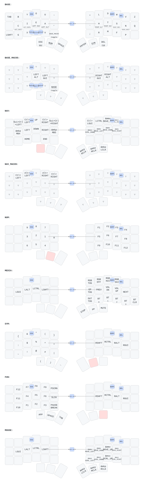

# Corne ZMK Keymap



Split ergonomic keyboard (42 keys) running [ZMK firmware](https://zmk.dev) on Nice!Nano v2.
Miryoku-style layout adapted from TOTEM config.

## Layers

| # | Layer | Thumb Key | Description |
|---|-------|-----------|-------------|
| 0 | BASE  | -         | QWERTY + home row mods (GACS) |
| 1 | NAV   | Hold SPACE| Vim arrows, clipboard, PgUp/Dn |
| 2 | NUM   | Hold BSPC | Number pad + math ops |
| 3 | MEDIA | Hold ESC  | RGB, Bluetooth, media, volume |
| 4 | SYM   | Hold ENTER| Symbols `{ } $ % ^ & *` |
| 5 | FUN   | Hold DEL  | F1-F12, PrintScreen |
| 6 | MOUSE | Hold TAB  | Mouse movement, scroll, clicks |

## Home Row Mods

Hold the home row key instead of tapping:

| Key | Tap | Hold  |
|-----|-----|-------|
| A   | a   | GUI   |
| S   | s   | Alt   |
| D   | d   | Ctrl  |
| F   | f   | Shift |
| J   | j   | Shift |
| K   | k   | Ctrl  |
| L   | l   | Alt   |
| '   | '   | GUI   |

## Combos

### Essential
| Keys  | Output    |
|-------|-----------|
| F + J | Caps Word |
| W + E | Escape    |
| I + O | Backspace |
| O + P | Delete    |

### High Value
| Keys  | Output        |
|-------|---------------|
| S + D | Tab           |
| K + L | Enter         |
| X + C | Copy (Cmd+C)  |
| C + V | Paste (Cmd+V) |
| X + V | Cut (Cmd+X)   |

### Vertical Symbol Combos
| Keys  | Output     |
|-------|------------|
| J + M | `-` minus  |
| H + N | `_` under  |
| F + V | `=` equal  |
| S + X | `` ` `` grave |
| L + ' | `;` semi   |

## Special Keys

- **Hyper key** (right outer column, home row): GUI+Alt+Ctrl+Shift modifier
- **Ctrl/Esc** (left outer column, home row): Tap for Esc, hold for Ctrl

## Display

- **Left (central):** Built-in ZMK status screen (layer, battery, BT)
- **Right (peripheral):** Custom P keycap logo with glitch effects + battery + BT status

## Interactive Viewer

Open the HTML keymap viewer locally:

```sh
make viewer
```

Press `?` to open the cheat sheet. Press `0-6` to switch layers.

## Build Firmware

Push to `config/` or `build.yaml` triggers the [Build ZMK firmware](.github/workflows/build.yml) workflow. Download the `.uf2` files from the Actions artifacts.

## Regenerate Keymap SVG

Runs automatically on push via [Draw Keymap](.github/workflows/draw-keymap.yml), or locally:

```sh
make install   # one-time: pip install keymap-drawer
make svg       # parse + render SVG
```

## Hardware

- **Board:** Nice!Nano v2 (nRF52840)
- **Shield:** Corne (split, 6x3+3)
- **Display:** OLED SSD1306 128x32 / Nice!View
- **RGB:** 27 WS2812 LEDs, 60% max brightness
- **Bluetooth:** 4 profiles
- **ZMK Studio:** Enabled
- **Mouse/Pointing:** Enabled
